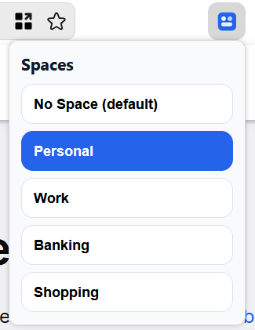
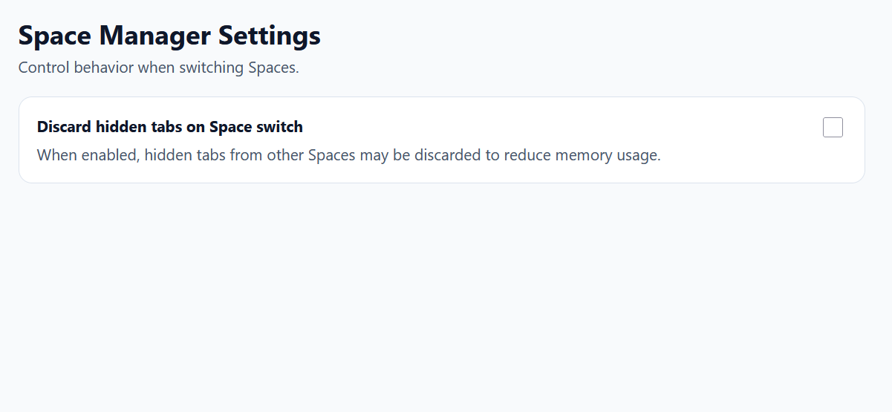

# Space Manager

  

Space Manager is a Firefox WebExtension that turns Container Tabs into workspace-like Spaces per window.

[Install from AMO](https://addons.mozilla.org/en-US/firefox/addon/space-manager/) | [MIT License](LICENSE)

## Features

- Reads Spaces from Firefox containers (`contextualIdentities`).
- Shows `No Space (default)` and all existing containers in the toolbar popup.
- Switches active Space per browser window.
- Shows tabs from the selected Space and hides tabs from other Spaces.
- Includes a setting to control whether hidden tabs are discarded on Space switch.
- Remembers the last active tab per Space and window.
- Keeps tab groups isolated by Space and restores group metadata when returning.
- Colors the toolbar icon based on the active Space color.
- Recreates some newly created default-store tabs inside the active Space or opener container.
- Recovery action in Settings: **Reset Spaces View** (current window) to show all tabs, restore saved groups, and switch to **No Space** without changing container identities.

## Screenshots

### Space Switcher

  

### Settings

  

## Privacy and Data Handling

- The extension does not send browsing data, cookies, or tab metadata to remote servers.
- The extension does not load or execute remote code.
- In private windows, Space state is session-only and is not persisted to `storage.local`.
- Closing a private window clears remembered Space, last-tab state, and tab-group snapshots for that private window.

## How It Works

- Firefox containers are the source of truth.
- Create, rename, and delete containers in Firefox settings.
- Space Manager reflects those container changes automatically.
- The extension does not maintain a separate container CRUD model.

## Recovery

- Use **Settings -> Recovery -> Reset Spaces View** to recover a window view.
- The action shows all tabs in the current window, restores saved tab groups, and switches that window to **No Space**.
- Container identities (`cookieStoreId`) are preserved.

## Development

Prerequisites:
- Node.js 20+

Useful scripts:
- `npm run check`
- `npm run lint`
- `npm run build`

Temporary local run:
1. Open `about:debugging#/runtime/this-firefox`.
2. Click **Load Temporary Add-on...**.
3. Select `manifest.json`.

## Project Structure

- `background/core/*`: shared namespace, constants, and utility helpers
- `background/storage/*`: local state storage
- `background/services/*`: spaces, switching, and icon behavior
- `background/controllers/*`: browser event and runtime message handling
- `background.js`: dependency wiring
- `popup/*`: toolbar popup UI

## References

- [MDN WebExtensions](https://developer.mozilla.org/en-US/docs/Mozilla/Add-ons/WebExtensions)
- [MDN contextualIdentities API](https://developer.mozilla.org/en-US/docs/Mozilla/Add-ons/WebExtensions/API/contextualIdentities)
- [MDN tabs.hide](https://developer.mozilla.org/en-US/docs/Mozilla/Add-ons/WebExtensions/API/tabs/hide)
- [MDN tabs.discard](https://developer.mozilla.org/en-US/docs/Mozilla/Add-ons/WebExtensions/API/tabs/discard)

## License

MIT
